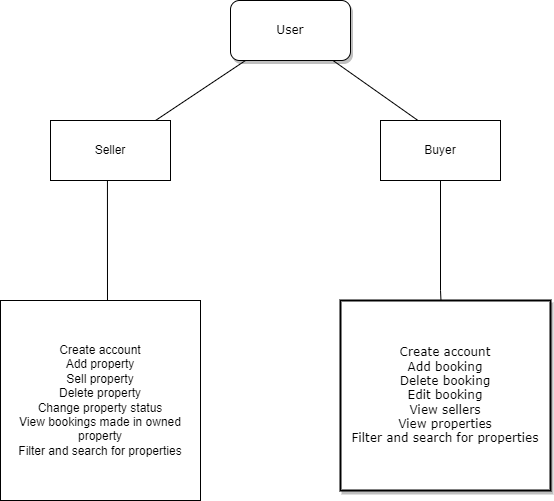

#  HOUZEZ

  
#  ABOUT ME
## My name is Abraham Kolawole and I have a cough (WORST TIMING) so please bare with me.

## Decision behind project name 
Houzez sounds immediately understandable, the word came into my mind while working on the project and I loved it!

#  About the project
Houzez is a property website designed to manage properties, catered to both buyers and sellers. Built using React, Tailwind CSS, and JSON Server for data handling, it offers a user-friendly interface and simple functionalities for seamless property management and booking.

## Task management
Trello board was super helpful.
(shows trello board)

## Codebase structure
After creating the tasks on the trello board, i spent most of my time working on the project structure. I wanted to makes sure almost all the code was reuseable.
(shows codebase)

## Project architecture

## DEMO TIME!!!!

#  Getting Started
This project was bootstrapped with [Create React App](https://github.com/facebook/create-react-app). You need to have npm and node and also json server installed on your system before you can run the project.

 - npm: 
  `npm install npm@latest -g`

 - json-server: 
  `npm install json-server-g`

## Installation

To get started on running this project, follow these steps:

 1. Clone the repository 
    `https://github.com/Abraham1999/dundee-project-1.git`
    
   2.  Install NPM Packages in root folder
    `npm install` 
    
    3.  Execute the following commands in separate terminals within the root folder
     `npm start` 
     `npm run server`
   

> npm start: Launches the web application in development mode on port 3000
> npm server: Runs the JSON server on port 5000 for data fetching. (You can also run `npx json-server --watch src/data/db.json --port 5000` in your terminal to start the server).

   
   Once both terminals execute successfully, visit [http://localhost:3000](http://localhost:3000)  to access the landing page.

# USAGE
  
## Seller Flow

**Registration page**

On  [http://localhost:3000](http://localhost:3000), click on get started to access the register page, sellers can add their details and an account is created.
After successful registration, sellers are redirected to the  [property](http://localhost:3000/property) page.

**Login page**

Visit [http://localhost:3000/login](http://localhost:3000/login) to login using email and password.
After successful registration, sellers are redirected to the  [property](http://localhost:3000/property) page.

**Buyers page**
 1. On the [buyers](http://localhost:3000/buyers) page, a table with a list of buyers on the platform should be on the page.
 2. Filter funcionality and search functionality to render buyers based on your filter or search terms (the search terms include - first name, last name and email address).
 3. Click on a particular buyer to navigate to the buyer detail page.
 4. On the buyer detail page, you should see the buyer details.

**Bookings page**
 1. On the [bookings](http://localhost:3000/bookings) page, a table with a list of all bookings should exist. You should see all bookings for the properties you own only and should not see other sellers bookings.
 2. Filter functionality and search functionality to render bookings based on your filter or search terms (the search term being the address, post code and booking.

**Property page**
 1. On the [property](http://localhost:3000/property) page, the list of all properties in the db should show.
 2. Filter functionality and search functionality to render properties based on your filter or search terms (the search term being the type, bathroom, bedroom, address, post code).
 3. Create property button should be seen by sellers only
 4. On the create property page, you should be able to create a property using the form
 5. Click on a particular property and you should see the property details.
 6. As the property owner, you should be able to view the delete property, edit property and change status buttons.
 7. The edit property button gives you the ability to edit the property using the add property form
 8. The delete button should delete the property
 9. The change status button should allow you to change the status of the property and also select the buyer of the property. Changing a property to sold deletes all the property bookings made.
 10. You should be able to view all bookings added in your property. 

## Buyer Flow

**Registration page**

On  [http://localhost:3000](http://localhost:3000), click on get started to access the register page, buyers can add their details and an account is created.
After successful registration,  buyers are redirected to the  [property](http://localhost:3000/property) page.

**Sellers page**
 1. On the [sellers](http://localhost:3000/sellers) page, a table with a list of all the sellers on the platform should be on the page.
 2. Filter functionality and search functionality to render sellers based on your filter or search terms (the search terms include - first name, last name and email address).
 3. Click on a particular seller to navigate to the seller detail page.
 4. On the seller detail page, you should see the properties the seller owns and their details.
 5. Select a property to go to the property page.

**Bookings page**
 1. On the [bookings](http://localhost:3000/bookings) page, a table with a list of all bookings should exist. You should see all bookings you made. you should not see other buyers bookings.
 2. Filter functionality and search functionality to render bookings based on your filter or search terms (the search term being the address, post code and booking.

**Property page**
 1. On the [property](http://localhost:3000/property) page, the list of all properties in the db should show.
 2. Filter functionality and search functionality to render properties based on your filter or search terms (the search term being the type, bathroom, bedroom, address, post code).
 3. Click on a particular property and you should see the property details.
 4. As the buyer, you should be able to view the add, edit and delete booking button.
 5. You should be able to add and edit a booking.
 6. The edit booking button gives you the ability to edit the booking you created.
 7. The delete button should delete the booking

Have a list of bookings added to all properties
show the datepicker component as it grays out the dates and show the code.
Don't show add and delete functionality. 

Demo flow

Have two firefox windows open
1. logged in as a seller
2. not logged in

- When you run the project, you see the landing page, scroll through it and click on get started.

- Show the register page.
Explain how through reuseable component you use one form to create either a seller or a buyer

I am going to show the flow of a seller
- Open firefox window 2
After creating an account, you should see the property page. 
I can add a property - show the property form
Click on a property i own, show the different things i can do.

Click on a property i do not own and show that they do not exist.

The buyers page just shows a list of buyers

the booking page shows all the bookings for all the properties i own, for now i own just 1 (only 1 property should be owned by the seller so that all the bookings will be deleted) so these are all the bookings for my 1 property. 

Change project status to sold and select buyer.

Then navigate to booking and show empty table, 

s that is the flow of a user
on firefox window 2, show the login page, login using the buyer details, then see the property page.

Click on 1
Show the booking you have, 
show that you can edit it but cant select a date that has been taken

Show the sellers page and click on 1 and show how you can see the properties.
Show bookings and how you can delete one

Finally show the filter componenet
Show the code for filter componenent 
show the helpers page
show the way its called in the 4 pages

talk about  how you reused it in all the pages and show the switch.

Talk about how challenging it was to fit all the filter functionalities into one switch and how it became unreadable so u had to separate it.

Challenge faced was i could not use the same switch for managing all the filters, i had to use different switches for different components. 
I tried todo it and the switch code became so so so long so i just said no i need to break this down

Show responsiveness on mobile

Questions

The end